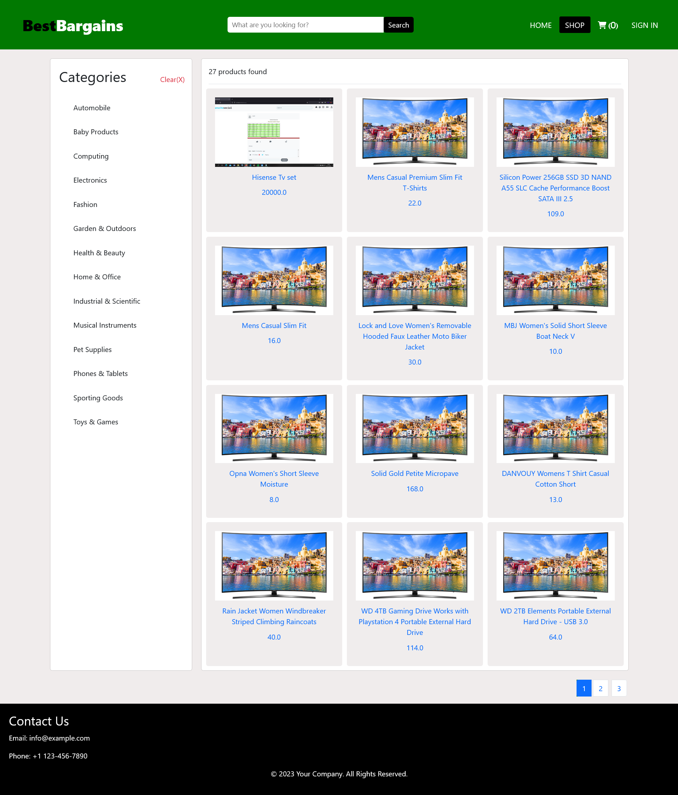

## Best Bargains Ecommerce

- Best bargains is a simple yet functional ecommerce website where users from different parts of the world can buy and sell their products.



Live Project Link:
    - http://app.bestbargainsecom.me

### Functionality

Authentication:

    ✅ SignUp
    ✅ Login
    ✅ Logout
    ❌ Reset Password
    ❌ Email Confirmation

User Stories:

    ✅ View products
    ✅ Preview a product
    ✅ Add product to cart
    ✅ View items in cart
    ✅ Update quantity of products in cart
    ✅ Update profile in both customer and Merchant Dashboard
    ✅ Merchant add a product
    ✅ Merchant update product
    ✅ Merchant delete product
    ❌ Customer Checkout and Ordering
    ❌ Payment Integration
    ❌ Merchant customer list in dashboard
    ❌ Merchant order List in dashboard


#### Tech Stack:

Frontend

* Bootstrap
* Html 
* Css
* Javascript

Backend and Deployment:

* Python3
* Flask
* mysql database
* nginx - reverse proxy
* gunicorn - uwsgi server


### setup project locally

###### Create a virtual environment:

    >  python3 -m venv <environment>

###### Install dependencies

    > pip install -r requirements.txt

###### Setup environment variables:

    - The environment are needed to setup the database and add the secret key
    ```
        DB_USER="" DB_PWD="" DB_HOST="" DB_NAME="" DB_PORT="" SECRET_KEY=""
    ```

##### run migrations and update db:

    - flask --app run_app db migrate -m "migration message"

    - flask --app run_app db upgrade

    NB:

        - If you get ``` Target database is not up to date. ```
        - when running the migrate command Run

        Run:
        > flask --app run_app db stamp head

        - and the rerun the migration

##### Add new products to database:

    - flask --app run_app shell

    - In the shell import the script add_products

    - >>> import add_products

###### Run application:

    On windows:

    ``` flask -e ".env" --app run_app run --debug  ```
    - The .env should be path to your environment variables

    On linux:

    - python3 -m run_app

##### Run tests:

    - python -m unittest discover app/tests

##### Help scripts:

    - Test the code for pep 
    > ./check_style

    - Run all tests
    > ./run_tests